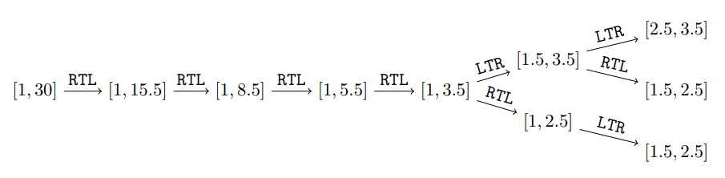

# 2024 ICPC Asia Taichung Regional Programming Contest

- 連結：[https://codeforces.com/contest/2041](https://codeforces.com/contest/2041)
- 時間：2024 Nov 17, 09:30-14:30
- 團隊：NYCU_MyGO!!! (SorahISA, ub33, nella17)
- 成績：10 / 14, Penalty 874, dirt 9% (
  <b style="color:lime">A</b>
  <b style="color:lime">B</b>
  <b style="color:lime">C</b>
  <b style="color:lime">D</b>
  <b style="color:lime">E</b>
  <b style="color:lime">F</b>
  <b style="color:lime">G</b>
  <b style="color:lime">H</b>
  <b style="color:lime">I</b>
  <b style="color:red">J</b>
  <b style="color:red">K</b>
  <b style="color:red">L</b>
  <b style="color:lime">M</b>
  <b style="color:red">N</b>
)

## A. The Bento Box Adventure

##### Tags: N/A

> 輸入四個 $1 \sim 5$ 之間的相異正整數 $a, b, c, d$，請判斷 $1 \sim 5$ 哪個數字沒出現過
> 
> * $1 \le a, b, c, d \le 5$

輸出 $15 - (a+b+c+d)$ 即可。

## B. Bowling Frame

##### Tags: N/A

> 有 $w$ 個白色瓶子跟 $b$ 個黑色瓶子。你要排成 $n$ 排，滿足第 $i$ 排有 $i$ 個相同顏色的瓶子，請求出 $n$ 的最大值。
> 
> * 測資數量 $\le 100$、$0 \le w, b \le 10^9$

待補

## C. Cube

##### Tags: `bitmask dp`

> 找到三個 $1, 2, \ldots, n$ 的排列 $\Arr{x}, \Arr{y}, \Arr{z}$ 使 $\sum A_{x_i, y_i, z_i}$ 最大。
> 
> 輸出該最大值就好。
> 
> * $n \le 12$、$0 \le A_{x,y,z} \le 2 \cdot 10^7$

待補

## D. Drunken Maze

##### Tags: `bfs`

> 給定一個 $n \times m$ 的矩陣，其中恰有一個起點跟一個終點，且有些位置是不能行走的牆壁。你每次可以朝著四方位相鄰的格子移動一步，但是你不能連續四步走同樣的方向，請求出起點到終點的最短路徑長度（不存在則輸出 $-1$）。
> 
> * $n, m \le 10\,000$、$nm \le 200\,000$、邊界都是牆壁

一樣用 BFS 紀錄最短路即可，但狀態要多兩個維度紀錄走了哪個方向（大小為 $4$）跟走了幾步（大小為 $4$）。

- $\texttt{dis}[r][c][d][s]$ 代表抵達 $(r, c)$ 且此前 $s$ 步的方向都是 $d$ 的最短路徑長度。

只要從 queue 裡面 pop 出 $(r_t, c_t, *, *)$ 就能直接輸出答案。

時間複雜度：$\Ord(nm \cdot 4 \cdot 4)$。

## E. Beautiful Array

##### Tags: N/A

> 請構造一個長度介於 $[1, 1000]$、數值界於 $[-10^6, 10^6]$ 的整數陣列滿足其平均值為 $a$ 且中位數為 $b$。
> 
> * $|a|, |b| \le 100$

輸出 $-1000 - b$、$b$、$1000 + 3a$ 即可。

## F. Segmentation Folds

##### Tags: `top-down dp`, `prime sieve`

> 有一個區間 $[\ell, r]$ 跟兩種摺疊操作 $\texttt{LTR}$、$\texttt{RTL}$：
> 
> - $\texttt{LTR}$：選擇最大的 $x$ 滿足 $\ell < x \le r$ 且 $\ell + x$ 是質數，並將區間縮小為 $[(\ell + x) / 2, r]$。
> - $\texttt{RTL}$：選擇最小的 $x$ 滿足 $\ell \le x < r$ 且 $r + x$ 是質數，並將區間縮小為 $[\ell, (r + x) / 2]$。
> 
> <figure></figure>
> 
> 請輸出有幾種摺疊操作的序列可以使最後的區間長度最小。請輸出答案模 $998\,244\,353$ 的值。
> 
> * 測資數量 $\le 10$、$1 \le \ell < r \le 10^{12}$、$r - \ell \le 100\,000$

觀察到新的端點 $\frac{\ell + x}{2}$ 或 $\frac{r + x}{2}$ 乘以 $2$ 之後是質數，於是問題可以被變化為以下模樣：

- 初始區間是 $[2\ell, 2r]$。
- $\texttt{LTR}$：選擇 $\le \frac{\ell + r}{2}$ 的最大質數當作新的 $\ell$。
- $\texttt{RTL}$：選擇 $\ge \frac{\ell + r}{2}$ 的最小質數當作新的 $r$。

於是可以先篩出區間 $[2\ell + 1, 2r - 1]$ 內的質數。由於每個合數 $a$ 必定有一個 $\le \sqrt{a}$ 的質因數，所以透過預處理 $\sqrt{2C}$ 以下的質數再對區間進行篩選（就跟一般質數篩很像，除了左界要調整到第一個 $> p$ 的 $p$ 的倍數），就能在 $\Ord((r - \ell) \ln (r - \ell))$ 時間篩出區間內所有質數。

考慮直接對其進行 top-down 的 DP。質數數量每一 fold 大約會變成一半，於是複雜度大約是 $\Ord(r - \ell)$。

還不會好好證明複雜度，待補。

## G. Grid Game

##### Tags: `vbcc`, `implementation`

> 有一個 $n \times n$ 的白色棋盤，其中有 $q$ 個垂直的長條被塗成黑色的，保證白色的區塊四方位連通。請求出有多少個位置滿足該位置被塗黑之後白色的區塊不再四方位連通。
> 
> <figure></figure>
> 
> * 測資數量 $\le 125$、$n \le 10^9$、$\sum q \le 100\,000$

假設所有格子都被建出來，那麼直接在上面找割點就是答案了。不過本題的格子數量太多，所以要想辦法減少重要點的數量。

待補

## H. Sheet Music

##### Tags: `math`

> 定義兩個長度皆為 $n$ 個序列 $\Arr{a}, \Arr{b}$ 本質相同，若且惟若對所有 $1 \le i \le n-1$ 皆有以下其中一種情況成立：
> 
> - $a_i < a_{i+1}$ 且 $b_i < b_{i+1}$
> - $a_i = a_{i+1}$ 且 $b_i = b_{i+1}$
> - $a_i > a_{i+1}$ 且 $b_i > b_{i+1}$
> 
> 請問有多少個本質不同、長度為 $n$、且每個元素都是 $[1, k]$ 之間的正整數序列？
> 
> 請輸出答案模 $998\,244\,353$。
> 
> * $n \le 10^6$、$k \le 10^9$

先假設沒有 $k$ 的限制，那麼答案就是 $3^{n-1}$。

再假設沒有 $=$ 的狀況，那麼合法的序列就是所有沒有連續 $k$ 個 $>$ 或 $<$ 的序列，這個序列的數量可以透過 DP 求得。

$$
f_\ell = \sum_{i=1}^{\min(k-1, \ell)} f_{\ell - i}
$$

初始狀態為 $f_0 = 2$、目標答案就是 $f_{n-1}$，可以用前綴和 $\Ord(n)$ 計算。

現在考慮多出 $=$。顯然 $=$ 可以放在任何地方，所以如果有 $e$ 個 $=$，那麼答案就是 $f_{n-1-e} \cdot \binom{n-1}{e}$。

$$
ans = \left( \sum_{e=0}^{n-1} f_{n-1-e} \cdot \binom{n-1}{e} \right) - 1
$$

時間複雜度：$\Ord(n)$。

## I. Auto Complete

##### Tags: `trie`

> meow
> 
> * meow

待補

## J. Bottle Arrangement

##### Tags: 

> 給定 $\Arr{a}, \Arr{b}$，你可以將 $\Arr{b}$ 的若干位置減一並將整個 $\Arr{b}$ 重新排序，使得
> 
> - $b_1 \le \cdots \ge b_n$（$b$ 是 bitonic sequence）
> - $b_i < a_i$ for all $1 \le i \le n$
> 
> 請輸出最少要對多少位置減一，如果全部都減一仍不可能達成，則輸出 $-1$。
> 
> * $n \le 500\,000$、$1 \le a_i, b_i \le 10^9$、$\Arr{b}$ 全部元素皆相異

待補

## K. Trophic Balance Species

##### Tags: 

> 給定一張簡單有向圖，定義一個集合 $S$ 是獨立集若且唯若 $S$ 中的點兩兩不可達。
> 
> 定義 $a_u$ 是從點 $u$ 出發可以抵達的點的數量，$b_u$ 是可以抵達點 $u$ 的點的數量。請求出 **所有** $\argmin_{u} \lvert a_u - b_u \rvert$。
> 
> * $n \le 200\,000$、$m \le 400\,000$、最大獨立集大小 $\le 16$

待補

## L. Building Castle

##### Tags: 

> 給定一個凸多邊形 $\mathcal{C}$，請找到一個 $180^\circ$ 旋轉對稱的凸多邊形 $\mathcal{C}'$ 使得 $\mathcal{C} \oplus \mathcal{C}'$（對稱差）的面積最小。
> 
> 輸出該對稱差的面積即可。
> 
> * $n \le 500$、$|x_i|, |y_i| \le 10^4$、座標皆是整數、沒有三點共線、誤差容許 $10^{-4}$

待補

## M. Selection Sort

##### Tags: 

> 給你一個長度為 $n$ 的序列 $\Arr{s}$，你可以對前綴跟後綴分別各做至多一次排序（哪個先都可以，也可以不做），對 $k$ 個元素排序的 cost 是 $k^2$，請求出最小的 cost 使陣列排好序。
> 
> * $n \le 1\,000\,000$、$0 \le s_i < 2^{31}-1$

首先可以把 $\Arr{s}$ 離散化到 $[0, n)$，相同數字就以位置來排序。

待補

## N. Railway Construction

##### Tags: 

> 有一張 $n$ 個點的圖，其中有 $m$ 條邊 $(u_i, v_i)$ 被丟掉了，沒被丟掉的邊 $(u, v)$ 的 cost 是 $a_u + a_v$。
> 
> 請對 $i = 1, 2, \ldots, n$ 求出：不使用點 $i$ 的情況下的最小生成樹 cost，無解則輸出 $-1$。
> 
> * $n \le 100\,000$、$m \le 100\,000$、$1 \le a_i \le 10^9$

待補

