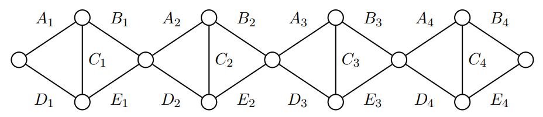

# 2024-2025 CTU Open Contest

- 連結：[https://codeforces.com/gym/105442](https://codeforces.com/gym/105442)
- 時間：2024 Nov 1, 14:44-19:45
- 團隊：NYCU_MyGO!!! (SorahISA, ub33, nella17)
- 成績：9 / 12, Penalty 803, dirt 30% (
  <b style="color:lime">A</b>
  <b style="color:red">B</b>
  <b style="color:red">C</b>
  <b style="color:lime">D</b>
  <b style="color:red">E</b>
  <b style="color:lime">F</b>
  <b style="color:lime">G</b>
  <b style="color:lime">H</b>
  <b style="color:lime">I</b>
  <b style="color:lime">J</b>
  <b style="color:lime">K</b>
  <b style="color:lime">L</b>
)

## [A. Flag Bearer](https://codeforces.com/gym/105442/problem/A)

##### Tags: `implementation`

水題，跳過

## [B. Cowpproximation](https://codeforces.com/gym/105442/problem/B)

##### Tags: `geometry`, `binary search`

> 給 $n$ 個圓 $\mathop{\text{Circle}}(x_i, y_i, r_i)$，求最小的 $t$ 使得 $\bigcap\limits_{i=1}^{n} \mathop{\text{Circle}}(x_i, y_i, r_i + t)$ 非空。
>
> * $n \le 1000$、$|x_i|, |y_i| \le 1000$、$r_i \le 1000$、誤差 $10^{-5}$ 以內。

經典題，對 $t$ 二分搜之後檢查每個圓的圓周上是否存在一點在所有圓內。

兩圓交點弄出了一堆 bug，現在還沒 AC。

待補

## [C. Reptile Eggs](https://codeforces.com/gym/105442/problem/C)

待補

## [D. Fishception](https://codeforces.com/gym/105442/problem/D)

##### Tags: N/A

> 一開始平面上有 $4$ 個點形成了一個矩形（邊不用平行座標軸），接著有 $n-1$ 次操作，每次會加入 $4$ 個點，這四個點會形成一個新的矩形，且新矩形嚴格包含了其他矩形們。
> 
> 給 $4n$ 個平面上的點，代表所有操作後的點，求原本的矩形的面積。
>
> * $n \le 50\,000$、$|x_i|, |y_i| \le 10^9$

每次拔掉凸包上的點，$n-1$ 次之後就會剩下原本的四個點。

- Case 1: 最外面的矩形不平行座標軸
  - 那 $x$、$y$ 座標最大、最小的點各不相同且必定在凸包上。
- Case 2: 最外面的矩形平行座標軸
  - 那 $x$、$y$ 座標最大、最小的點各有兩個，但容易看出這些點的集合只有四個點且必定在凸包上。

用兩個陣列維護按照 $x$、$y$ 座標排序的 ID，剩下的用 `while` 迴圈就很好做。

## [E. Pigpartite Giraffe](https://codeforces.com/gym/105442/problem/E)

待補

## [F. Hamster](https://codeforces.com/gym/105442/problem/F)

##### Tags: N/A

水題，跳過

## [G. Pray Mink](https://codeforces.com/gym/105442/problem/G)

##### Tags: `dp`

待補

範圍夠小，對效率沒有特別要求時用遞迴解會比較好做。

## [H. Ornithology](https://codeforces.com/gym/105442/problem/H)

##### Tags: N/A

水題，跳過

求逆序數對可以用以下 code 搭配 BIT 來計算

```cpp
int ans = 0;
for (int x : arr | views::reverse) {
    ans += bit.ask(x-1), bit.add(x, 1);
}
```

## [I. P||k Cutting](https://codeforces.com/gym/105442/problem/I)

##### Tags: `binary search`, `sparse table`

> 給定非負整數 $a_1, a_2, \ldots, a_n$ 以及非負整數 $k$，求有多少個 subarray $1 \le \ell \le r \le n$ 滿足
> 
> $$(a_\ell \mid a_{\ell+1} \mid \cdots \mid a_r) = k$$
> 
> * $n \le 400\,000$、$0 \le k \le 10^9$、$0 \le a_i \le 10^9$

OR 只會越變越大，可以以每個位置當左界做二分搜。

先用 sparse table 預處理區間 OR 就能做到 $\Ord(n \log n)$。

## [J. Rabid Rabbit](https://codeforces.com/gym/105442/problem/J)

##### Tags: `sweep line`

> 給定正整數 $a_1, a_2, \ldots, a_n$ 以及 $q$ 次詢問 $(\ell, r)$，求
> 
> $$\lvert \{ a_i + a_j : \ell \le i < j \le r \} \cap \{ F_i : i \ge 1 \} \rvert$$
> 
> 其中 $F_0 = F_1 = 1$，$F_{k_{(\ge 2)}} = F_{k-1} + F_{k-2}$ 是費氏數列。
> 
> * $n \le 10^5$、$q \le 10^5$、$1 \le a_i \le 10^9$

嘗試對每個 $F_k \le 2C$ 回答所有詢問。

令 $(i, j)$ $i < j$ 滿足 $a_i + a_j = F_k$，如果把 $(i, j)$ 打到二維平面上，那麼一個詢問 $(\ell, r)$ 相當於是詢問存不存在 $(i, j)$ 滿足 $i \ge \ell$ 且 $j \le r$。

所有有意義的 $(i, j)$ 可以用 `map` 對每個 $j$ 找前面最後一個 $F_k - a_j$ 的出現位置來求出。

把詢問跟 pair 依照左界（$x$ 座標）由大到小排序，只需要維護前綴 pair 的最小 $y$ 座標即可 $\Ord(1)$ 求解。

整體複雜度是 $\Ord(n \log n \log C + q \log C)$。

## [K. Fellow Sheep](https://codeforces.com/gym/105442/problem/K)

##### Tags: N/A

> 有一個長度 $n$ 的以下這種圖，給定 $(A_i, B_i, C_i, D_i, E_i)$，求左端點到右端點的最大流。
> 
> <figure></figure>
> 
> * $n \le 100\,000$、$1 \le$ 值域 $\le 10^8$

有四種不同路徑

- $A \to B$
- $D \to E$
- $A \to C \to E$
- $D \to C \to B$

對每塊取這四個 $\min$ 的 $\max$ 加起來就是答案。

## [L. Watchdogs](https://codeforces.com/gym/105442/problem/L)

##### Tags: `lca`, `minimum vertex cover`

> 給一棵 $n$ 個點的樹，有 $k$ 隻老鼠在樹上，每隻老鼠只能在 $u_i \leadsto v_i$ 路徑的重心（可能有一個或兩個）被抓到。
> 
> 求最少需要在多少個點放置捕鼠器才能抓到所有老鼠。
> 
> * $n \le 100\,000$、$0 \le k \le 100\,000$

求路徑中點就是經典 LCA 題。

每隻老鼠能被抓到的位置要嘛是一個點（可以看成自環），要嘛是樹上的一條邊連接著的兩個點。所以問題就變成要在樹上的某個子圖做點覆蓋。

可以樹 DP 就好，也可以直接砸 Dinic。以下是最大流的做法：

- 因為樹是二分圖（考慮深度奇偶性），所以可以建如下的圖：
  - 源點連到深度為奇數的點
  - 深度為偶數的點連到匯點
  - 對老鼠能被抓到的邊，將深度為奇數的點連到深度為偶數的點
  - 對老鼠能被抓到的點，因為他一定要被選到，於是就新增一個虛點，並看奇偶決定怎麼連邊
  - 每條邊的流量皆為 $1$
